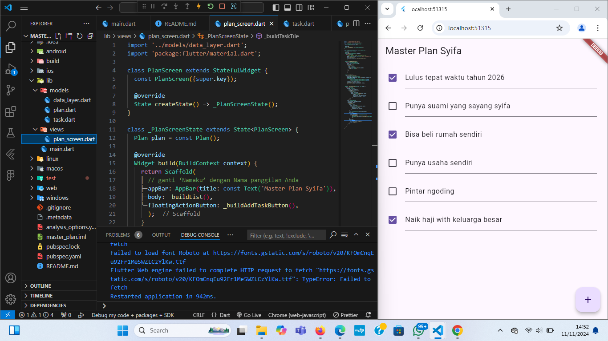

# Tugas Praktikum Dasar State Management
Nama: Syifa Kharisma Nayla
NIM: 362358302019
Kelas: 2B TRPL

- Praktikum 1: Dasar State dengan Model-View
1. Dasar State dengan Model-View

2. Jelaskan maksud dari langkah 4 pada praktikum tersebut! Mengapa dilakukan 
demikian?
JawabL: 
Kemudahan Pengelolaan
Konsistensi
Peningkatan Produktivitas
Pemeliharaan Lebih Mudah

3. Mengapa perlu variabel plan di langkah 6 pada praktikum tersebut? Mengapa dibuat 
konstanta ?
Jawab: 
variabel plan digunakan untuk menyimpan instance dari kelas Plan, yang kemungkinan merupakan model data yang mewakili rencana atau daftar tugas yang akan ditampilkan di layar PlanScreen. 

4. Lakukan capture hasil dari Langkah 9 berupa GIF, kemudian jelaskan apa yang telah 
Anda buat!
Jawab: 
Pada langkah 11 dan 13 dalam kode tersebut, terdapat dua metode lifecycle penting untuk widget stateful di Flutter: initState dan dispose. Keduanya digunakan untuk menginisialisasi dan membersihkan resource, terutama untuk objek yang memerlukan manajemen khusus seperti ScrollController

5. Apa kegunaan method pada Langkah 11 dan 13 dalam lifecyle state ?
Jawab:
- langkah 11
Penjelasan:
- initState(): Dipanggil pertama kali saat State object dibuat.
- ScrollController: Digunakan untuk mengontrol dan mendeteksi perubahan scroll.
- ddListener(): Menambahkan listener yang akan menghilangkan fokus dari elemen (seperti TextField) saat pengguna menggulir, sehingga keyboard akan disembunyikan.

Langkah 12
Penjelasan:
- controller: scrollController: Menghubungkan ScrollController ke ListView.
- keyboardDismissBehavior: Menentukan bagaimana keyboard disembunyikan saat menggulir. Pada iOS, keyboard akan disembunyikan saat menggulir (onDrag), sedangkan pada platform lain harus manual (manual)

langkah 13
Penjelasan:
- dispose(): Dipanggil saat State object akan dihancurkan.
- scrollController.dispose(): Membersihkan ScrollController untuk mencegah kebocoran memori.

